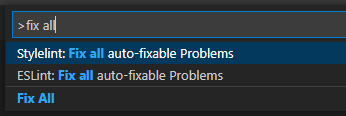

# Contributing to Crust

## Getting Started
1. Follow the [Tauri prerequisites guide](https://tauri.app/v1/guides/getting-started/prerequisites)
2. Fork this project
3. Clone the project to your local system — `git clone https://github.com/<your_github_username>/crust.git`
4. Change to the project root directory — `cd crust`
5. Install all dependencies using npm — `npm install`
6. Run the project in development mode — `npm run tauri dev`

## Recommended VS Code Extensions
We have some [recommended extensions](.vscode/extensions.json) for use with VS Code, such as ESLint and Stylelint.

## Style Guide
We use ESLint and Stylelint for our styling rules. If you are using our recommended extensions then we strongly suggest that you use these settings for your workspace:
```json
{
  "editor.tabSize": 2,
  "rust-analyzer.rustfmt.extraArgs": [
    "--config",
    "tab_spaces=2"
  ],
  "stylelint.validate": [
    "css",
    "less",
    "postcss",
    "scss",
    "vue"
  ]
}
```

To run ESLint or Stylelint for all files, use these premade scripts:
- `npm run eslint`
- `npm run stylelint`

Or, to fix linting errors in the current file, run the "fix all auto-fixable problems" commands:



## Scripts
- Run the project in development mode — `npm run tauri dev`
- Build the project for release — `npm run tauri build`
