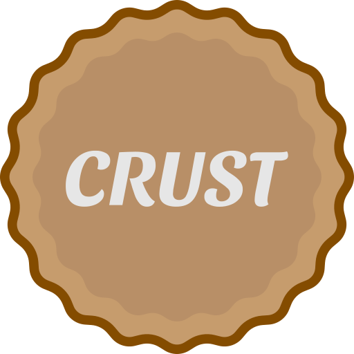

<b>Crust</b>, a lightweight chat and screen sharing application.

---

# What is Crust?
Crust is a peer-to-peer voice and text chat application with high-resolution screen sharing support.

This app was made to avoid the downsides of a server-based subscription model, such as Discord, which imposes arbitrary restrictions to the quality of screen sharing. Our app uses a peer-to-peer model to provide unrestricted control to the user.

Your data is encrypted end-to-end and does not travel through any servers. You're in control of your own data; we cannot and do not examine, censor, nor remotely store your communications.

# Installation
WIP

# Contributing
See [CONTRIBUTING](CONTRIBUTING.md).

# Features
WIP

# License
Distributed under the GNU General Public License v3.0. See [LICENSE](LICENSE) for more information.
